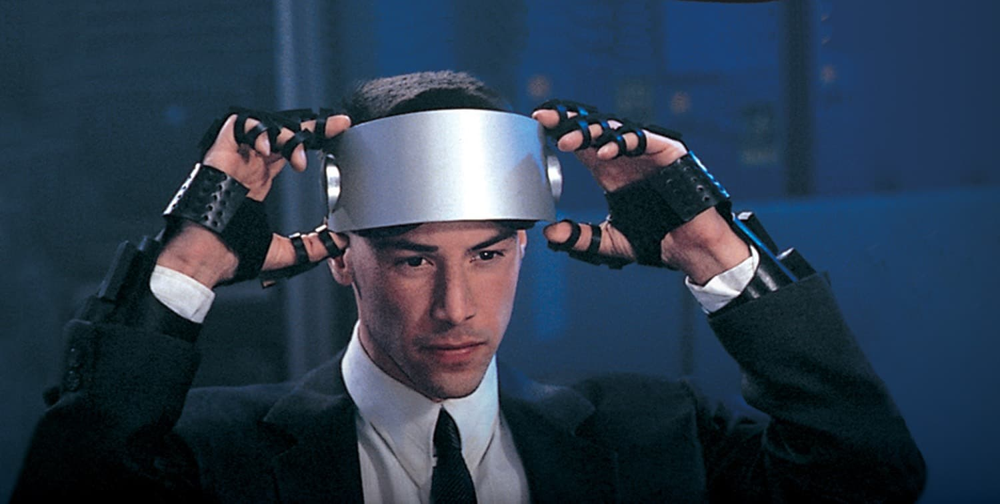

# 3OS: A Volumetric Operating System Interface

Johnny Mnemonic showed a 3D VR internet in 1995:
<a href="https://www.youtube.com/watch?v=SoxGazX_kkw" target="_blank" rel="noopener noreferrer">
  
</a>

This movie was shy of the mark, but it hinted at a 1990s sense of optimism toward 3D computer interfaces eventually becoming better, faster, and more efficient than 2D desktop equivalents. Obviously that didn't happen. YET. What happened to that optimism though?

Was it proven to be bunk? Are 3D interfaces destined to be slower than desktop PCs? Or did we simply stop investing in the VR industry for a decade after the dot-com bust, allowing mountains of incredible university research to collect dust in SIGCHI archives, never to be drawn upon again by modern industry titans?

---

## What is 3OS?

3OS (pronounced **"three-oh-ess"**) is a voxel-first operating system interface that attempts to take us back to our roots by drawing upon incredible 90s research (not Hollywood but actual excellent-yet-rarely-utilized university work - see the Prior Art section) to implement an interface that could make XR faster than desktop PCs for productivity tasks. Target hardware is HMDs, holographic displays, and any future hardware that enables stereoscopic depth visibility. 3OS rejects the "flatland" bias of legacy WIMP (Windows, Icons, Menus, and Pointers) and multi-touch paradigms that have been a crutch in modern XR for far too long. 3OS aims to knock the dust off of the works of HCI giants whose contributions got buried by the mobile era and prove that 90s optimism was not misplaced.

---

## WIMP is wimpy

The WIMP paradigm is a backwards compatibility tool in XR. It should not be front-and-center in any spatial computing OS. A VR or MR HMD that uses WIMP as its default metaphor set is like Windows 95 launching into a command line with no Desktop, no Start button, and no File Explorer, except at least the command line still brought extra speed for power users. WIMP interfaces do the opposite in XR, yet they're the ONLY OS interface in 2026, rather than a background legacy option. We cannot expect enterprise software suite companies to consider porting their robust systems into XR using stone tools.

## 3OS Basics

Instead of forcing users to aim virtual laser pointers at floating 2D windows, 3OS treats the entire environment as a high-capacity voxel field where the parameterized resolution defaults to a 3-inch voxel, the approximate size that satisfies high selection accuracy at rapid speed with 6DOF 10-finger hand motion (see the Trivariate validation below). The goal is to provide users a voxel grid representing all the subdivisions of 3D space in which they can hover, select, or otherwise interact with any voxel in under 0.25 seconds regardless of their body's distance away from that voxel. This is an impossible feat in all current spatial computing operating systems because of the false assumption that OS interfaces must use WIMP.

At 3 inch voxel resolution and a default 50-foot radius from head pose to the grid's outer shell, the grid contains on the order of ~150 million voxels if the user is standing in a wide open field. Theoretically, it could be larger as some viewers have accurate parallax stereo vision up to several hundred feet, but 3-inch objects side-by-side shrink into uselessness via perspective long before that distance, thus 50ft is a decent parameterized ballpark limit.

3OS is built in OpenXR and intended as a module to plug into any spatial computing OS. It is fully open-source under the MIT license, and it does not replace existing OS infrastructure, since WIMP-based interfaces still need to be installed for backwards compatibility, just as Windows 95 couldn't launch without command line dialogs.

The 20-teens era of spatial OS design is the Xerox PARC era. The Windows 95 era is almost upon us. 3OS attempts to help clear the brambles of what an OS interface may look like in this new era. It can plug into a current OS and become the default, or it can become an optional alternative interface. If you like 3OS and you want to see it installed in the OS of your favorite HMD, email that company, share the repo link, and let them know the code is free!

---

## The Problem

Software companies (Adobe, Autodesk, Salesforce, Intuit, Shopify, etc.) assess whether they should port their legacy platforms into a new OS frequently. Their software is typically web-browser first for cross-platform efficiency, but even with cross-platform apps, the most robust productivity tools in these apps typically run on the desktop version only.

**Why?**

These companies understand that touchscreens are more of an entertainment consumption platform than an enterprise productivity platform. There are exceptions, but a majority do not port all the desktop features of enterprise software onto mobile devices because...

**Multi-touch interfaces...**

1) ...are physically smaller. Shrinking the number of available interactive fragments reduces multitasking capability exponentially, hence why iOS requires developers to severely limit the number of user choices per screen controller.

2) ...cannot compete with desktop interfaces due to mouse/keyboard blowing multi-touch out of the water on throughput.

3) ...actively discourage manual raw data management by obfuscating direct data access, implying that some OS makers do not want the developer community thinking of touchscreens as capable of cannibalizing desktop/laptop sales through competitive levels of productivity. 

It follows, though, that if you INCREASE the number of interactive fragments (or voxels) instead of decreasing it, shortened total adjacency and multitasking capability should explode exponentially beyond the capability of the best desktop interfaces. Enterprise workers understand the simple virtue of multi-screen setups, but their value barely scratches the throughput surface of multiple screens times multiple layers of depth, IF we use those layers.

Why then is the boot interface of EVERY XR OS patterned after Apple and Android? It implies "this is a platform that can't do the things your desktop PC can do." WindowsMR by Microsoft was a notable exception aesthetics-wise. Microsoft clearly recognized the problem, yet they failed to hone in on its linchpin: WIMP itself.

If you try to complete nearly any run-of-the-mill office PC tasks on any XR OS, common features make progress so God-awfully slow that no enterprise company would ever consider porting their desktop feature sets into XR in the 2020s.

XR has greater enterprise potential than desktop computers. Raw throughput capability will one day be proven to be king as soon as the right OS interface enables it to shine. AI voice-based interfaces are part of that story, but we can't always speak our work into a computer. Sometimes, work needs to be more private, even among colleagues in a shared office. We can't adopt XR in the office if the interaction model slows us to a crawl in these moments. Thus, XR must present an interface that is faster than desktop interfaces WITH OR WITHOUT an AI assistant.

---

## The Solution

The "right" XR interface must solve the three glaring challenges that keep XR interfaces slow:

**1) No Near-Field/Far-Field Parity:** The user has instant intuitive access to the near field, but extremely slow/cumbersome (if any) access to the far field. Since the far field is more than 90% of the whole field, the total productivity canvas in XR ends up smaller with lower throughput than its desktop equivalent. A 2D desktop screen has hundreds of pixel fragment zones in which to place colocated buttons, text labels, images, etc. with rapid access to every one of them at once.

XR has millions of interaction zones in each frustum which would enable adjacency efficiency and multi-tasking that blows desktop interfaces out of the water, but most of these zones are unreachable without silly raycast fishing reel actions, an impossible wrench in the gears for throughput. Imagine requiring 30 seconds to click an icon in Windows. Furthermore, we can't easily see how ridiculously slow our XR interfaces are because this throughput drag is hidden by #2.

**2) WIMP Insufficiency:** The crutch of WIMP denies the use of the depth vector in concert with common 2D table layouts (i.e. WIMP makes 3D matrix and cluster layouts impossible), which occludes the vast potential utility of the XR field almost entirely, which in turn masks the throughput jank of the default raycasting interaction model. Raycasting successfully hides how terribly slow it is by forcing us to drive our Ferrari at 5mph as though that's how fast all racecars drive. A model that can enable hands or cursors to hover in any subdivision of the field volume with equivalent effort must replace the legacy model.

**3) Perspective vs. Isometric Spatial awareness:** We see in perspective, but perspective can warp our mind's eye of Euclidean space. Our very short arms define the near field where perspective causes almost unnoticeable size warping, thus our mind's eye for hand coordination is formed isometrically. We think of 3D space the way it actually is... true width, depth, and height have an equal relationship, not a scalar one. We know the object moving away is not actually shrinking, but if we need to use a magical interface to reach out and touch that object, we should not expect our hands to easily convert to angular space where farther objects require scaled hand motions, e.g. the requirements of raycasting. To access the far field with equivalent efficacy to the near field, we need to use an isometric interaction model, one that treats hand motion in the near field identically to the far field.

Solve these problems, and enterprise adoption of XR can begin.

---

## 🏛️ 3OS Core Implementation Philosophy

1. **Voxels, Not Surfaces:** The fundamental building block of UI/UX in 3OS is a discrete coordinate volume (optimized at $\approx 3\text{ in}^3$ for reliable human motor capability under rapid hand motion), not a pixel fragment or a flat projection plane. 

2. **The Drummer's Rule:** A spatial OS should never subordinate micro-precision tasks to macro-stability muscles. First and foremost, this means the user should never be required to walk across a room to engage with an object simply because that object is outside the near field. The lost energy and time of closing the gap to bring the object into reach is a cardinal enemy of productivity. In 3OS, we compress far field spatial volumes into near field proxies called Voodoo Volumes instantaneously so that interaction is entirely driven by high-speed, low-fatigue motor groups (eyes, wrists, fingers), keeping the shoulder girdle (**coracobrachialis**) kinetically neutral for a vast majority of each session. The user can walk during use of the interface if the interface is anchored to their body rather than to the room, but large full-body "walk-across-the-room" actions are never required to manipulate a given element. At most, ten-finger or 6DOF-controlled actions require the elbow to move no more than 1.5 inches out of its neutral pose, and developers should encourage the elbow to return to neutral pose for a majority of any experience. This rule is derived from the Moeller Method that enables drummers to play for hours without fatigue. This methodology comes from the author's personal experience as a drum teacher relating drum student arm fatigue to common "gorilla arm" issues in HCI research.

3. **Topology vs. Kinematics:** 
Spatial interaction in 3OS is comprised of...
    **Portals** (macro-topology; managing *where* data lives via instant coordinate remapping) and...
    **Telekinesis** (micro-kinematics; managing *how* data is arranged on smaller scales via velocity-controlled telekinesis). 
These two methods follow 80/20 Pareto distribution, where most objects occupying field space can and should be teleported into position via Voodoo Portals, though the user may occasionally desire to shift them telekinetically if the distance is fairly short.

---

## Ergonomics Determine Interactivity Resolution

**The limits of the body determine ideal interaction volume bounds:** 

The Trivariate Target paper by Grossman and Balakrishnan was instrumental in determining how large the voxels should be for fast-moving hands in a voxel-based OS. The default assumption in 3OS is that hands will be moving rapidly at various moments within the bounding box of a given voodoo volume. The constraint of elbow position for "gorilla arm" prevention requires a specific bounding box size for that volume. That size is determined by beginning with the hands as close to complete rest as possible while still being visible to the HMD for tracking, which places them at the height of the navel, 12 inches forward from the body with elbows completely at rest in their neutral hanging position beside the body.

**Derived Interaction Volume Parameters (Body Anchor/Height/Offset):**

With palms up or down, the hands define the bottom plane of the ideal voodoo volume bounding box in this navel-level position. The center of the bounding box is approximately 12 inches forward of the navel, allowing the user to place fingertips in the center of the box's bottom plane simply by touching their fingertips together with both hands. This is not a gesture to instantiate the box. It's merely an imaginary reference to show approximately where the box anchor lives if the user instantiates it direction forward of the stomach. The user can instantiate multiple voodoo volumes side-by-side. 3OS may use IPD and/or user height to estimate the ideal offset of the voodoo volume's center anchor. A height of approximately 12-18 inches above that center point constitutes the total height of the voodoo volume bounding box because lifting fingers above that height immediately overtaxes the coracobrachialis muscle, which connects the collar bone to the bicep bone. This muscle can handle hours of flex below the height of eye-level fingertips, which gives us approximately ~18 inches max for the voodoo volume height. The box may have a small offset away from the body defined by 3OS near-field point cursor parameters. For instance, if the near-field cursor offset in front of the hand is 3", then the voodoo volume should also be offset forward of the navel by three more inches.

**Research-backed Voxel Size:**

See [spatial_os_trivariate_validation.md](spatial_os_trivariate_validation.md) for proof that 3" voxel size is ideal for any spatial computing OS in which users want to move hands voxel-to-voxel without overshoot, yielding an ideal 3×3×5 matrix as our default voodoo volume. Objects can certainly be bigger and smaller than this resolution, but the underlying default size of objects and spaces between objects if grid-snapping is ever in use will follow this format, and developers of 3OS apps must note that if they want to unlock the fastest possible user hand motion, they should build elements no smaller than this approximate target. 3OS parameterizes all of these default assumptions.

---

## 🔄 The 3OS Unified Interaction State Machine

To eliminate physical exhaustion ("Gorilla Arm") and sluggishness of legacy XR selection systems, 3OS routes all user intent through a deterministic, cascading three-stage state machine.

```
[State 1: Macro-Targeting] ──> [State 2: Micro-Resolution] ──> [State 3: Possession / Transform]
(World Proxy Half-Dome)         (Double Proxy Voxel Grid)       (Velocity-Mapped CRUD Action)
```

### State 1: Macro-Targeting (The World-in-Miniature Proxy)
* **The Problem:** 

  Humans cannot easily gaze at or raycast an empty voxel in which to instantiate or manage far field elements. A single stationary gaze vector penetrates thousands of voxels simultaneously. The ability to choose any one voxel in the entire field must be rapid and intuitive.
* **The Solution:** 
  
  Via gesture or button press, the user instantiates a localized, downscaled translucent **World Proxy Half-Dome** within comfortable, nearly-at-rest reach. 

### State 2: Micro-Resolution (The Double-Proxy Voxel Lattice)
* **The Mechanism:** 

  The moment a coarse region is selected in the World Proxy Half-Dome, that specific slice of space instantly blooms into a **Double-Proxy Voxel Grid** directly in front of the user's primary workspace. The chunk of empty space is proxied to the user. Simultaneously, the user's hand or cursor is proxied out into that chunk in the far field.
* **Lattice Visualization:** 

  The hidden coordinate structure of that far field volume is rendered locally as a subtle, wireframe volumetric lattice.
* **Decoupled Selection:** 

  The user drives a point cursor offset by a few inches away from the driving hand to prevent that hand from occluding the proxy. The user is free to gaze at the actual fragment in the far field, using the peripheral proxy as a remote control device, or if the fragment is too far away for good visual fidelity, the user can look primarily at the proxy instead. Cursor hover and selection can initiate CRUD actions, especially CREATE functions if the current proxy contains empty voxel space. Menu options e.g. Create New Box (3D equivalent of a folder) or Create New Object (3D equivalent of a file) are typically presented in matrix layout as long as there are more than four options.

### State 3: Possession & Transformation (Jean Grey Engine)
* **The Mechanism:** 

  An already created object can be hovered by sending a point cursor inside its volume rather than raycasting onto its surface. Once hovered, the user can select it with a gesture, usually index pinch. Once selected, the user has the option to use the proxy (a voodoo doll) as a transformation remote control for **Velocity-Based translation and/or rotation**.
* **Kinetic Economy:** 

  Tiny, low-fatigue wrist gestures generate acceleration and velocity vectors that scale proportionally, gliding objects effortlessly across the field.
* **Momentum & Friction:** 

  The system incorporates virtual inertia. Releasing an asset with momentum allows it to slide naturally through the voxels and settle based on an OS-level spatial friction coefficient.

---

## 🌀 Volumetric Workspace Management: Portals & Teleportation

3OS bypasses the slow, physics-based fishing-line-reeling or lassoing of legacy XR by utilizing **Non-Euclidean Voodoo Volumes**.

* **Voodoo Volume Portal Dragging:** If a double-proxy voodoo volume is open, dragging an object from the near field into the voodoo volume teleports that object out into the far-field. Vice versa, dragging an object out of a voodoo volume teleports it from its far field volume into the near field. The need to grab onto a far field object with raycast and reel it in is entirely eliminated. The concept is heavily inspired by the Poros Framework (see Prior Art #6).
* **Cross-Proxy Portal Dragging:** If multiple double-proxy voodoo volumes are open, dragging an asset out of one local volume and dropping it into another triggers an instantaneous teleportation from volume A to volume B in the far field, essentially letting the object travel through two wormholes at once.
* **The Global Desktop Drop:** The World Proxy Half-Dome acts as an omnipresent directory. To move a massive dashboard to the back corner of a warehouse, the user grabs its near-field proxy and drops it onto a destination within the world proxy half-dome. A double proxy opens representing that spot and the object teleports into it.

---

## 🗂️ Volumetric Topology & System Architecture

### 1. The Selection Frustum
Multi-selection is resolved by pulling open both hands or twisting wrists in a dual-pinch to scale a dynamic bounding **Selection Frustum** inside the double-proxy volume. The possessed group behaves rigidly, preserving relative spatial offsets during velocity-mapped transformations.

### 2. Layered Coordinate Subordination
The system treats the origin $(0,0,0)$ as a fluid variable, allowing users to toggle fields across three structural anchor types:
* **Egocentric (User-Locked):** Subordinated to the user's body frame (travels with them).
* **Allocentric (World-Locked):** Grounded permanently into the physical architecture mapped by semantic room-mesh tracking.
* **Virtual / Canonical (Object-Locked):** Anchored to an arbitrary parent asset (e.g., a virtual desk), moving cohesively whenever the parent shifts.

### 3. Procedural Volumetric Layouts (Lattice Toggling)
Emulating the 2D File Explorer's view shifts, 3OS can instantly re-compute the spatial distribution of all active elements in a field:
* **Matrix View:** Collapses loose assets into tightly packed, perfectly aligned 3D cubic grids.
* **Cluster View:** Formulates structural groupings automatically based on shared metadata and semantic relationships.
* **Real Anchor View:** Disperses layouts instantly, snapping elements back to their assigned real-world surfaces or custom coordinate origins.

---

## 🧱 Architectural Enclosure & World Mesh Penetration

3OS strictly decouples Newtonian physics from spatial containment boundaries to preserve environmental stability and presence. These rules apply to all data structures the OS recognizes. These structures are analogous to files and folders of other operating systems, but they use different metaphors in 3D. For example, folders are boxes in 3OS. Files are objects whose low-poly prismatic geometry is defined by the application that generates the data, much like applications define file types and icons in other operating systems.

* **Global vs. Local Mode:** 3OS is in global mode by default, meaning if the user opens a box (i.e. drills into a folder) the contents of that box will emerge out of the box without dismissing the contents of the parent file structure. If the user opts to toggle global mode to local mode, then opening a box dismisses the objects at the parent level before revealing the contents of the box.
* **Rigidbody Matrix:** Set to `Disabled` by default for each object. The user can opt in a given object's properties to toggle physics on for that object, allowing it to receive gravity, collide with world geo, etc. Newly created objects float statically in zero-gravity space to eliminate continuous structural management chores. For OS objects, the user must manually turn gravity on if desired, but they should understand that full use of 3OS capability means allowing most objects to float.
* **Enclosure Engine:** Active by default with a `Strict` policy. Leveraging semantic AI mesh pipelines, the system enforces a hard spatial floor constraint—preventing floating voxels from clipping through physical floorboards or sinking into unreachable space even if their rigidbodies are disabled or they have none.
* **Semantic Masking:** For walls and ceilings, users can unlock constraints to place items "over-the-horizon" (e.g., a weather widget on a balcony). The OS cleanly cuts the rendering mesh at the wall boundary plane, creating a crisp, non-clipping partition illusion. 3OS has parameterized input enabling other service-layer systems of the HMD to provide planar definitions of such boundaries if desired.

---

## Common 3D Element Types

### 1) Objects
  3OS is intended for full cross-compatibility with desktop OS interfaces because the file metaphor remains intact in an extruded 3D-ified form. A file is an OBJECT in 3OS. Its icon is no longer an icon. It's a glyph, a low-poly prismatic piece of geometry that can represent the brand of the app that generated the file. In addition, 3OS will support treating media as objects as well, including audio clips, video clips, images, 3D assets, and point-cloud-based assets (particle effects and/or Gaussian splat assets).

### 2) Glyphs (`.3glyph`)
  A **glyph** is a specific type of object, a volumetric file type icon: a small, semi-transparent mesh plus associative metadata in one file. Packs are valid **glTF Binary (GLB)** renamed to **`.3glyph`**, with a root vendor extension `THREEOS_glyph` (schema, injector, and demo packs: [`docs/THREEOS_glyph.md`](docs/THREEOS_glyph.md)).

  **What lives in the pack (author-controlled):** mesh, UVs, textures, and `THREEOS_glyph` metadata (id, associations, tint hints, bounds). End users and companies are free to author branded looks with full UV/texture control inside the GLB.

  **What does *not* live in the pack:** host shaders. Packs must not embed Unity ShaderLab, Vulkan SPIR-V, or any other renderer-specific shader bytecode. The OS/host binds the current glyph material at load time.

  **Host shader (adapter, not pack content):**

  - **Unity alpha / demo:** instances use **`ThreeOS/Glyph`** ([`3OS_Unity/Shaders/ThreeOSGlyph.shader`](3OS_Unity/Shaders/ThreeOSGlyph.shader)).
  - **Later native hosts:** the same shading *contract* (translucent base + selection Fresnel) can be reimplemented in Vulkan (or Metal/D3D) without changing `.3glyph` assets—mesh, UVs, and textures keep working.

  The Unity shader is a single `SRPDefaultUnlit` pass (URP only runs one matching LightMode): translucent `_BaseColor` plus white Fresnel edge glow scaled by `_Selected` (0 = off, 1 = on).

  Selection is an OS affordance: the host sets `_Selected` (usually via `MaterialPropertyBlock`) and does **not** swap materials. Authors do not ship a separate “selected” material. Custom packs keep their mesh, UVs, and textures; the OS still owns the highlight so every third-party glyph gets a consistent stereo-safe selection look.

  **Authoring a `.3glyph` pack**

  1. Model a low-poly prismatic glyph in Blender (keep scale near the OS glyph size, ~0.1 m); author UVs and textures as desired.
  2. Export **glTF 2.0 Binary (`.glb`)** (textures embedded or referenced per normal glTF practice).
  3. Write or copy a pack JSON under [`docs/glyph_packs/`](docs/glyph_packs/) (`glyph_id`, `applies_to_extensions` or Box `box_state`, `tint_rgba` with alpha &lt; 1, etc.).
  4. Inject metadata:  
   `python tools/inject_3glyph.py path\to\mesh.glb docs\glyph_packs\<pack>.json`  
   → writes `path\to\mesh.3glyph` (still GLB bytes).
  5. Register the pack with the kernel at host startup (`threeos_glyph_install_pack` / Unity `InstallGlyphPack`).
  6. In the Unity host, assign materials that use **`ThreeOS/Glyph`** (or let `ThreeOSStorageController` create them). Drive selection with `_Selected` = `0` / `1`. Look-dev Fresnel via **Create → 3OS → Glyph Glow Settings** (assign on `ThreeOSStorageController`, or save as `Resources/3OS/GlyphGlowSettings.asset`).

  Content files (e.g. a user’s `report.pdf` or demo `simple.glb`) are **not** glyph packs — they keep their normal formats. Only the OS icon that *represents* that type is a `.3glyph`.

### 3) Boxes
  Boxes in 3OS are the 3D equivalent of folders in legacy platforms. They can expand/collapse all of their contents into the current field, and they are the control source for a variety of spatial arrangements. 3OS has a global box mode and a local box mode, meaning expansion of a box can automatically trigger collapse of any currently-expanded other boxes in local mode, or expansion can be cumulative with all other expanded boxes in global mode. 3OS deals with spatial collision resolution of nearest neighbors by bumping newcomers into the closest available adjacent space. Global and Local box modes are only relevant in Manual Arrangment Mode. In Matrix and Cluster Modes, nested child boxes expand to fill space in separate matrices or clusters above the parent matrices or clusters.

  **Options** (equivalent of View options in File Explorer):

  * **Manual:** All objects within the box store their own list of world anchors if they each recognize the current environment; otherwise they default to a matrix layout near and above the box on expand. This is the only mode in which the object's spatial position is stored within the object and recalled in future sessions.
  * **Matrix:** All objects default to a matrix layout near and above the box.
  * **Multi-Matrix:** All objects default to a matrix of matrices categorized by a chosen attribute (file name, application, age in years/months/weeks/days, etc.).
  * **Cluster:** All objects default to a cluster layout near and above the box.
  * **Multi-Cluster:** All objects default to a cluster of clusters categorized by a chosen attribute.
  * **Agent-Generated:** All objects default to a custom 3D layout generated by an AI assistant per user instructions, including advanced filtering, combinations of clusters and matrices of multi-condition criteria, etc.


### 4) Voodoo Volumes
  These are the workhorse of 3OS, merging the near and far field via non-Euclidean portal behaviors. To engage one, the user can manifest a World Proxy Half Dome which represents a miniature model of the entire field. While holding the gesture, the user drags a point cursor through the interior of the Half Dome, and a far-field voodoo volume instantiates and moves in concert around the actual field. By releasing this same gesture that opened the Half Dome, the user chooses where to drop the far field voodoo volume. Upon placing it, a near-field voodoo volume immediate replaces the half dome, opening the other end of the portal. Now any contents or empty space in that part of the far field are suddenly in hand's reach in the near field. Any objects or boxes encapsulated by the voodoo volume now show a ghostly copy of themselves easily within the user's reach. Likewise, the user can place a point cursor or hand into the vooodoo volume and a ghostly copy of their cursor or hand will appear out on the other end of the portal in the far field. The user is welcome to gaze at either the near-field voodoo volume or the far-field voodoo volume. The voodoo volume's bounding box can be pinched/stretched to scale the far-field bounding box while the near field bounding box remains the same ergonomically-perfect size. If an object in the volume is dragged in real far-field space, the far field bounding box will scale up to keep it in scope. Meanwhile, the bounding box of the near field volume will remain the same size, causing its inner contents to appear to scale down. The bounding box can also be single-hand dragged for velocity-based translation of the far-field bounding box. And finally, the voodoo volume will have an button at its top back right corner to collapse the portal.

### 5) Voodoo Widgets
  These are peripheral remote control devices. They appear temporarily just forward of the hand that engages the associated action, and they disappear as soon as the action is complete. The most common use is for remote transformations (dragging/rotating far-field objects). These widgets visualize the hand's current action state e.g. a vector arrow to confirm drag is currently active at a specific velocity. For rotation, the widget is a miniature voodoo copy the object so that any tumbling action can happen accurately even if the actual object is too distant to make out.

### 6) 3D Buttons
  In 3OS, buttons are typically depicted as translucent cubes or other simple volumetric prisms, often with smoothed edges. Text labels may hover near, above, below, or inside the geometry, typically shaded over the top of their geo to enable clear legibility even if geo occludes any part of the text. Buttons in 3OS are volumetric, meaning cursors don't hover ONTO them; they hover INTO them. If touched directly by virtual hands, the button surface has no physics properties. The hand travels through it as though it is a ghost. We call it a button to avoid confusion around functionality. It is an event trigger handler just like any other button, but it does not reside on a surface, nor is it to be pressed. It floats in mid air, needing no flat panel to rest upon. A cursor enters into it from any vector and triggers a hover-state glow effect or other visual cue. During hover, the user performs a gesture, usually index-to-thumb pinch, to activate the button.

### 7) Matrices
  Elements in legacy UI lay out on X and Y dimensions in table form. In a voxel-based OS, utilizing even one more interactive plane ahead of or behind the first plane unlocks more grid positions with less travel distance. For instance, a 4x4 or 2x8 table of elements in a 2D UI is much better laid out as a 2x2x2 matrix in 3OS. A minimum adjacency analysis on any collection of items will show matrices are ergonomically better and faster than tables.

### 8) Clusters
  Similar to matrices, but spatial positioning is more loose in that the objects need not align on any kind of local Euclidean grid. Instead, they operate on a set of min-max adjacency parameters from their nearest neighbors, usually grouped in close proximity due to some shared attribute.

### 9) Spherical Multi-Choice Nodes
  A 3D-ified radio button element. 3OS supports easy creation of these spherical interfaces which are similar to desktop radio button lists in that alternate choices (A or B or C etc.) are arranged near each other, but in 3OS they can occupy uniform angular space around a center point. They may render as segments of a sphere, or each as 3D buttons floating in a formation. The cursor's vector relative to the center point changes hover state enabling highlight of one of the elements in that collection. This interface style is the highest-performance voxel-based multiple-choice option because it eliminates any possibility of overshoot errors. The multi-choice node may have an extra core node at its center which could be an extra multi-choice option or a neutral "none" option, and it may also have an out-of-bounds limit radius encapsulating the group.


---

## Structural Outline
```
3os-core/
├── include/
│   ├── openxr/                     # OpenXR header dependencies
│   ├── core/
│   │   ├── interaction_facade.hpp  # Input Action Facade (Hover, Select, Group)
│   │   ├── topology.hpp            # World Proxy Half-Dome & Double-Proxy grids
│   │   ├── kinematics.hpp          # Telekinetic Velocity Engine (Zero-fatigue curves)
│   │   └── enclosure.hpp           # Semantic Mesh Occlusion & Floor Constraints
│   ├── storage/
│   │   ├── file_bridge.hpp         # Legacy FS Sync (Directories -> Volumetric Elements)
│   │   └── volumetric_glyph.hpp    # Translates extensions into low-poly prismatic meshes
│   ├── text/
│   │   ├── text_io_router.hpp      # Multi-modal input hub (External, Virtual, Volumetric)
│   │   └── text_label.hpp          # Lightweight 3D text primitives for Box/Object annotations
│   ├── ai/
│   │   └── agent_service_layer.hpp # Verbal Trigger Registry for host OEM AI integration
│   └── interop/
│       └── threeos_marshaller.hpp  # Flattened extern "C" bindings for P/Invoke & Dynamic Loading
├── src/
│   ├── interaction_facade.cpp
│   ├── topology.cpp
│   ├── kinematics.cpp
│   ├── enclosure.cpp
│   ├── storage/
│   │   ├── file_bridge.cpp         # Target directory crawler & delta-tracking engine
│   │   └── volumetric_glyph.cpp    # Procedural mesh compiler for text/data/box primitives
│   ├── text/
│   │   ├── text_io_router.cpp      # Prioritization router for physical vs. fallback input
│   │   └── text_label.cpp          # Transient floating text box CRUD lifecycle logic
│   ├── ai/
│   │   └── agent_service_layer.cpp # Binds semantic string hashes directly to 3OS system states
│   └── threeos_marshaller.cpp       # Core DLL/SO export implementations
├── shaders/
│   └── SemanticWallMask.hlsl       # Vertex/Pixel shader logic for wall clipping
├── .github/
│   └── workflows/
│       └── build-binaries.yml      # CI/CD cross-compilation pipeline (.dll and .so)
├── CMakeLists.txt
└── README.md

```

### 🏛️ 3OS_Core: Academic Lineage & Prior Art

Piles of incredible Human-Computer Interaction (HCI) literature have been left to languish by the modern spatial computing industry. In 2026, the following papers do not currently influence OS interfaces running on Meta Quest, Meta VR Glasses, Apple Vision Pro, Snap Specs, XReal Aura, Vive, Pico, Playstation VR, Lynx, Varjo, Bigscreen, or Steam Frame. They should.

By grounding **3OS** in this seminal research, we bridge the historic gap between the late-1990s proprioceptive research labs and modern non-Euclidean spatial interaction theories to break the productivity chains of WIMP. Despite raycast having double the throughput of isometric virtual hands (point cursors), it is unsuitable for rapid serial and/or parallel two-handed interactions. Point cursors, on the other hand, are stellar at utilizing two-handed speed boosts, which more than covers the throughput gap even before completely unlocking the far field, allowing point cursors to leave raycast in the dust.

---

### 1. The "Silk Cursor" — 1994

**Citation:** Zhai, S., Buxton, W., & Milgram, P. (1994). *The 'silk cursor': investigating visual cues on target acquisition in 3D user interfaces. Proceedings of the SIGCHI Conference on Human Factors in Computing Systems (CHI '94)*, 185–192.
*   **Significance to 3OS:** Introduced a future where raycast cursors must be abandoned in order to access the entire XR field, implying that interaction via perspective is inferior to interaction via isometry. The "silk" metaphor heavily emphasized the need for most interactive elements to utilize semitransparency in such a system to prevent occlusion from causing confusion. The same is true in 3OS.


### 2. Worlds in Miniature (WIM) — 1995
*   **Citation:** Stoakley, R., Conway, M. J., & Pausch, R. (1995). "Virtual reality on a WIM: interactive worlds in miniature." *Proceedings of the 22nd annual conference on Computer graphics and interactive techniques (SIGGRAPH '95)*, 265–272.
*   **Significance to 3OS:** This paper pioneered the paradigm of scaling down a massive, immersive 3D environment into a hand-held, near-field miniature copy to bypass the physical limitations of far-field targeting. It is the original world-to-user proxy, a voodoo doll of the entire virtual space. 3OS modernizes this concept into the **World Proxy Half-Dome**, updating it to track empty volumetric coordinate spaces and/or objects within those spaces.

### 3. Proprioceptive Interaction Models — 1997
*   **Citation:** Mine, M. R., Brooks Jr, F. P., & Sequin, C. H. (1997). "Moving objects in space: Exploiting proprioception in virtual-environment interaction." *Proceedings of the 24th annual conference on Computer graphics and interactive techniques (SIGGRAPH '97)*, 19–26.
*   **Significance to 3OS:** Proved that humans possess a highly accurate, innate biological awareness of their hands' positions relative to their body frames without requiring constant visual feedback (**proprioception**). This serves as the scientific bedrock for the **3OS Drummer's Law of Biomechanical Subordination**—keeping the shoulder girdle (coracobrachialis) completely neutral while the wrist and fingers drive intent inside near-field workspaces, i.e. peripheral remote controls in the near field manipulate objects in the far field.

### 4. The Foundational Voodoo Dolls Paper — 1999
*   **Citation:** Pierce, J. S., Stearns, B. C., & Pausch, R. (1999). "Voodoo Dolls: Seamless Interaction at Multiple Scales in Virtual Environments." *Proceedings of the 1999 symposium on Interactive 3D graphics (I3D '99)*, 141–145.
*   **Significance to 3OS:** Introduced the first dynamic object-proxy architecture, allowing users to instantiate scale-adjusted, hand-held replicas ("dolls") to manipulate distant assets bidirectionally. 3OS adopts this fundamental workflow but eliminates its rigid, skeuomorphic, object-bound limits—expanding proxies to target unconstrained voxel coordinate structures rather than just pre-existing 3D models.

### 5. Pointing at Trivariate Targets — 2004

*   **Citation:** Grossman, T., & Balakrishnan, R. (2004). "Pointing at trivariate targets in 3D environments." *Proceedings of the SIGCHI Conference on Human Factors in Computing Systems (CHI '04)*, 447–454.
*   **Significance to 3OS:** Introduced an important equation derived from Fitt's Law that models a 6DOF hand's ability to hit voxel-based targets in 3D space at maximum speed without overshoot. 3OS relies on a slight modification of this equation to determine the default 3" voxel size (see spatial_os_trivariate_validation.md).


### 6. The Poros Framework — 2021
*   **Citation:** Pohl, H., Lilija, K., McIntosh, J., & Hornbæk, K. (2021). "Poros: Configurable Proxies for Distant Interactions in VR." *Proceedings of the 2021 CHI Conference on Human Factors in Computing Systems (CHI '21)*, Article 357, 1–13.
*   **Significance to 3OS:** The direct conceptual and geometric peer to 3OS. This paper broke the legacy "Flatland" window paradigm by showing that users can select arbitrary volumetric bounding regions in the far field and mirror them as non-Euclidean near-field workspace portals. 3OS adapts this concept for bimanual selection frustums that are cubic instead of spherical. The most salient difference between Poros and 3OS is that Poros still used raycasting to generate portals, whereas 3OS engages world-in-miniature as the creation model for portals, yielding rapid cross-proxy multi-portal manipulation intended as a competitive 3D corollary to a 2D desktop File Explorer.

### 7. Reality Proxy — 2025
*   **Citation:** Al-Sadoun, A., et al. (2025). "Reality Proxy: Fluid Interactions with Real-World Objects in MR." *Proceedings of the 2025 CHI Conference on Human Factors in Computing Systems (CHI '25)*.
*   **Significance to 3OS:** Evaluated and validated that using spatial computer vision and semantic machine intelligence are crucial for streamlining the associations between world mesh geo and virtual content that fully utilizes the context of that geo.

### 8. Fitts' Law + XR Review of 122 studies  — 2025
*   **Citation:** Amini, M., Stuertzlinger, W., Teather, R.J., & Batmaz, A.U. "A Systematic Review of Fitt's Law in 3D Extended Reality" *Proceedings of the 2025 CHI Conference on Human Factors in Computing Systems (CHI '25)*.
*   **Significance to 3OS:** Identified that only 36% of XR HCI studies of the past several decades (44 total) that focused on throughput performance had targeted virtual hand (point cursor) interaction models, whereas more than 50% targeted raycast techniques. The other 14% were eye tracking studies.

---

## 🧬 Architectural Synthesis

3OS acts as the ultimate engineering synthesis of these two historical schools of thought:

```text
[1990s: Proprioceptive School]  --> Mine, Pierce, Pausch
                                    Exploited near-field body space to drop motor fatigue.
                                              │
                                              ▼
[2020s: Volumetric Portal School] --> Pohl, Hornbæk, McIntosh
                                    Proved non-Euclidean workspace remapping matrices.
                                              │
                                              ▼
[3OS Operating System Engine]   --> 3OS Core Kernel Architecture
                                    Synthesizes both tracks AND applies the unified theory to the entire field's voxel grid whether any given voxel is occupied or not, which finally unlocks the same near-instantaneous control over every voxel as a PC user has over every pixel without requiring the hands to move more than a few inches total before returning to fully relaxed rest.
```


## 🚀 Getting Started

```bash
git clone https://github.com/scifiuiguy/3OS.git
cd 3OS

cmake -S . -B build -DCMAKE_BUILD_TYPE=Release
cmake --build build --config Release
ctest --test-dir build -C Release --output-on-failure
```

The shared library target is `3os_kernel` (`3os_kernel.dll` / `lib3os_kernel.so`). The console harness prints `threeos_version` (currently `0.3.0`) and checks the frozen ABI (`InteropInputFrame` = 192 bytes). Host ABI headers: `include/interop/threeos_abi.h`. See [IMPLEMENTATION_PLAN.md](IMPLEMENTATION_PLAN.md); Unity Quest verification lives in [3OS_Unity](https://github.com/scifiuiguy/3OS_Unity).

*This project is dedicated to breaking the flatland illusion. Welcome to true volumetric computing.*